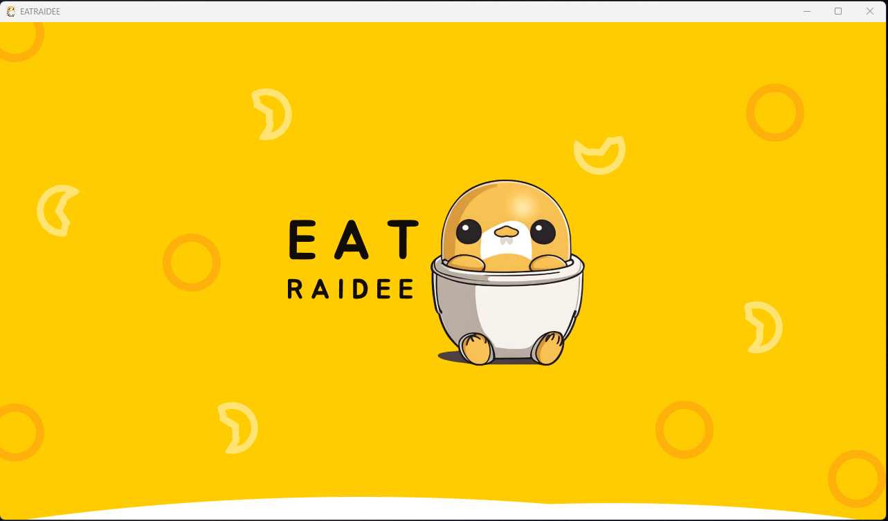
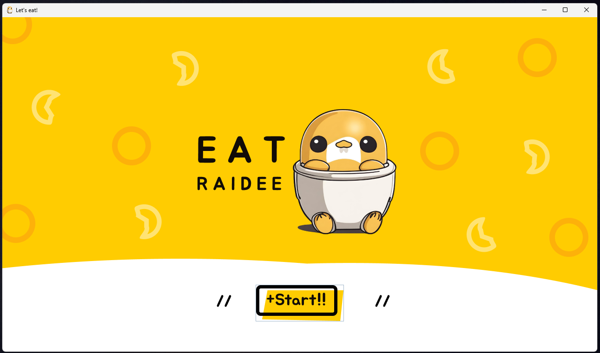
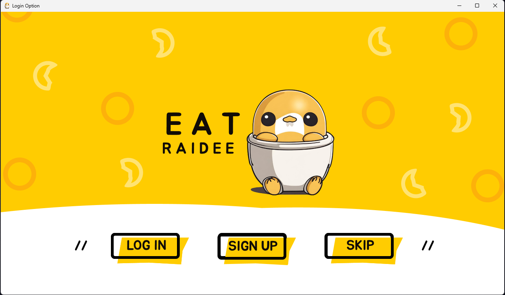
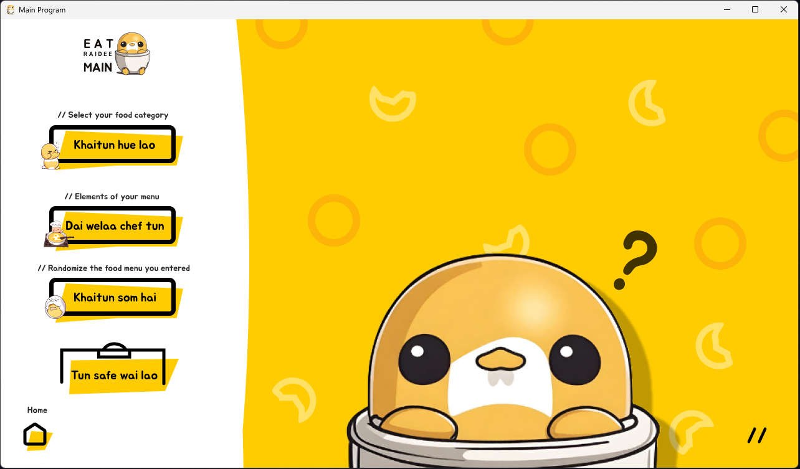
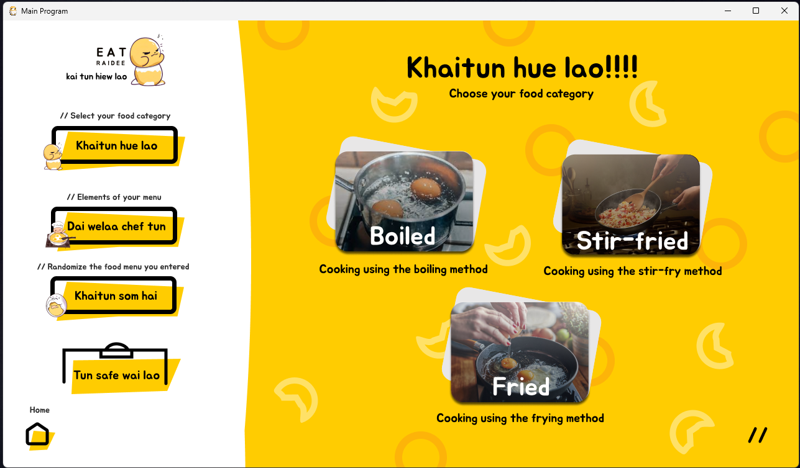
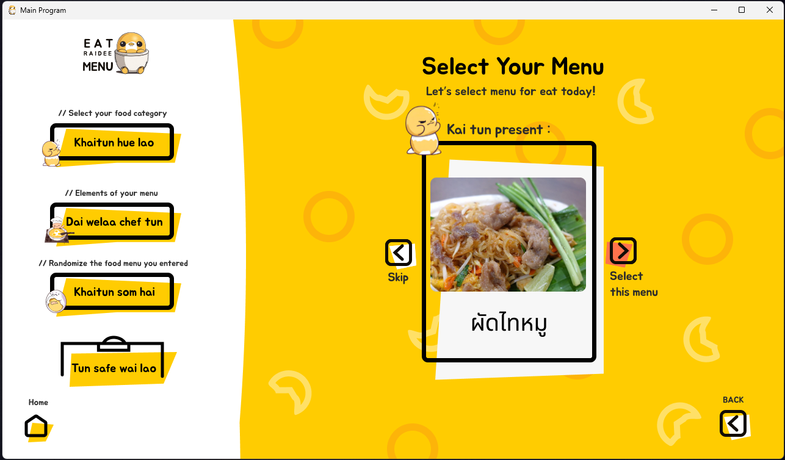
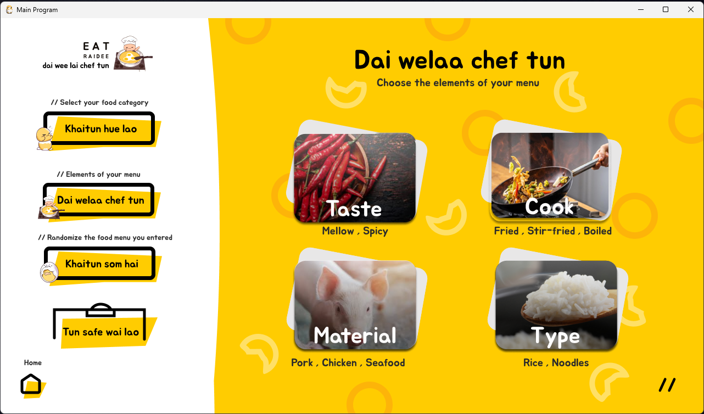
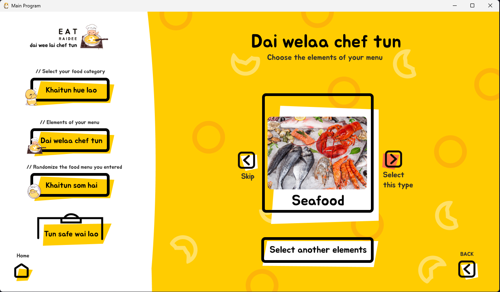
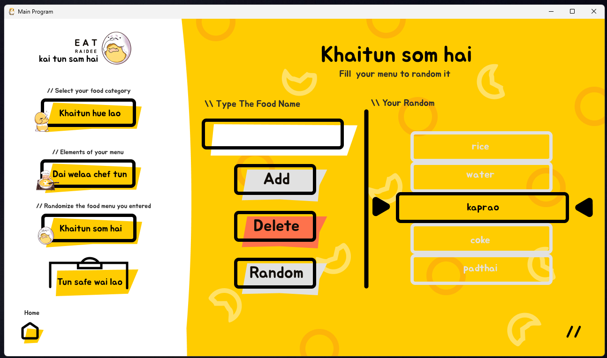
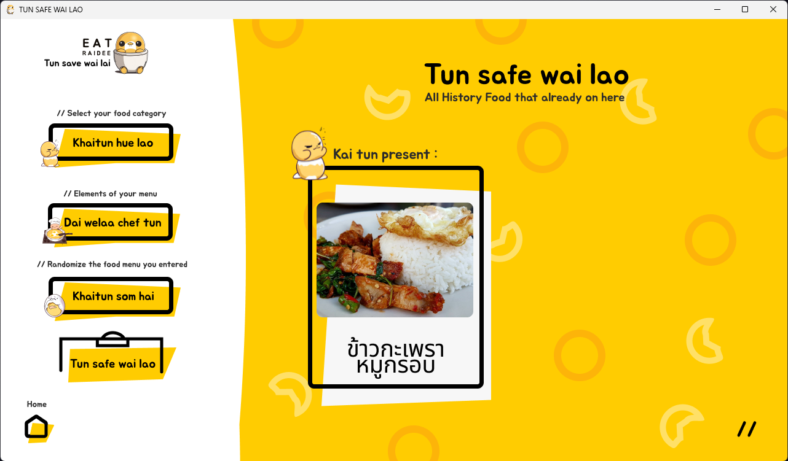

# 🍽️ Eatraidee

Eat Rai Dee (Eatraidee) เป็นโปรเจกต์ UX/UI และพัฒนาโปรแกรมที่มีเป้าหมายเพื่อช่วยให้ผู้ใช้ตัดสินใจเลือกอาหารเวลาที่ไม่รู้จะกินอะไรดี 😋  
ตัวโปรเจกต์นี้ถูกออกแบบ UX/UI ด้วย Figma และพัฒนาด้วยภาษา Java โดยใช้ Apache NetBeans

นี่คือโปรเจกต์แรกที่ผู้พัฒนาฝึกฝนและนำหลัก OOP (Object-Oriented Programming) มาใช้จริง 🧑‍💻  
ตัวแอปพลิเคชันจะสุ่มแนะนำตัวเลือกอาหารและแสดงผลลัพธ์บนหน้าจอคีออสก์  
ผู้พัฒนารับผิดชอบทั้งส่วนออกแบบหน้าตา (UI) และการเขียนโปรแกรมแกนหลัก

---

## 🚀 คุณสมบัติหลัก

- 🎲 สุ่มแนะนำเมนูอาหารให้ผู้ใช้
- 🖥️ แสดงผลลัพธ์คำแนะนำบนหน้าจอคีออสก์
- 🎨 ออกแบบ UX/UI ด้วย Figma
- ☕ พัฒนาและเขียนโค้ดด้วย Java (Apache NetBeans)
- 🧩 เน้นการเขียนโปรแกรมเชิงวัตถุ (OOP)

---

## 🖼️ ตัวอย่างหน้าจอ (Screenshots)

|                      |                      |                      |
|----------------------|----------------------|----------------------|
|  |  |  |
|  |  |  |
|  |  |  |
|  |                      |                      |

---

## 🛠️ วิธีการติดตั้งและใช้งาน

1. 📥 ดาวน์โหลดหรือโคลนโปรเจกต์นี้จาก GitHub
2. 🛠️ เปิดโปรเจกต์ด้วย Apache NetBeans หรือ IDE ที่รองรับ Java
3. ▶️ สั่งรันโปรเจกต์ตามขั้นตอนที่กำหนด 

---

## 👨‍💻 ผู้ร่วมพัฒนา (Developers)

- [etsuwithtea](https://github.com/etsuwithtea)
- [Jabiby7561](https://github.com/Jabiby7561)
- [Passadech](https://github.com/Passadech)

---

💡 หากมีข้อเสนอแนะหรือพบปัญหา สามารถเปิด Issue ใหม่ใน GitHub Repository นี้ได้เลย
